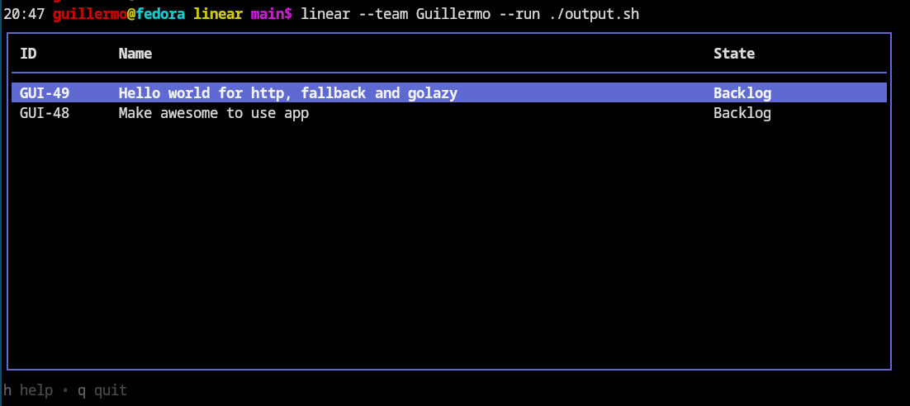

# Linear Issue Picker

This is a simplified CLI program to choose an issue from Linear, an SaaS issue tracker. It can significantly improve development workflows.



## Table of Content

- [Installation](#installation)
- [Setting Up](#setting-up)
- [How To Use](#how-to-use)

## Installation
Run the below command in your command line to install this tool:
```bash
go install github.com/guillermo/linear@latest
```
## Setting Up
Follow these steps to get your Linear API:
1. Visit [Linear API settings](https://linear.app/justwatch/settings/api).
2. Save the key in an environment variable named `LINEAR_KEY`.

*Recommended: Use a software like direnv to manage your environment variables.*

## How To Use
To view all issues for a particular team, replace `"My Team"` with your team's name and run:
```bash
linear --team "My Team"
```
It will display a list of issues. On selecting an issue, you'll see a string key in this format:
```
ID "TITLE" ISSUE_BRANCH
```
This program becomes even more powerful with the `--run` parameter which executes another program by passing the selected issue as an argument.

Here's an example of a bash script that accepts these parameters:
```bash
#!/bin/bash

help="Usage: issue ID \"TITLE\" BRANCH"
ISSUE=${1:?$help}
TITLE=${2:?$help}
BRANCH=${3:?$help}

echo ISSUE: $ISSUE
echo TITLE: $TITLE
echo BRANCH: $BRANCH
```
Launching the program with the following command:
```bash
linear --team "My team" --run issue.sh
```
Will print:
```
ISSUE: MY-1
TITLE: My first issue
BRANCH: guillermo/my-first-issue
```

